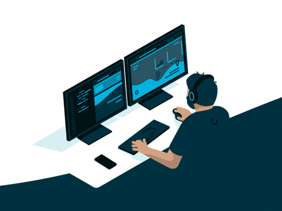

<h1>Bem Vindo ao meu GitHub</h1>

Sou desenvolvedor de sistemas, formado como Técnico em Informática e atualmente cursando o tecnólogo em Análise e Desenvolvimento de Sistemas. Ao longo da minha trajetória, participei de diversos projetos acadêmicos e pessoais que contribuíram diretamente para o meu crescimento técnico e organizacional. Para facilitar a visualização do meu perfil, selecionei abaixo algumas das minhas principais realizações:

<h3>Projetos Web</h3>

***[Hamburgueria do Prazer](https://github.com/WashingtonCost/Hamburgueria) ***
Projeto Full Stack com integração ao Banco de Dados

16 Telas: 
Login/Cadastro Usuário/Cadastro Funcionário 
Menu/Lanches/Combos/Bebidas/Porções 
Entrega/Pedido/Reserva 
Cupons/Pagamentos 
Apoie-nos/Localização/Chefes

(Projeto realizado para fins de aprendizado, dentro da minha instituiçao de ensino IFRO - Campus Ji-Paraná) projeto concluído por minha equipe e eu em 2023.

<h3>Projetos Desktop</h3>

***[Calculadora](https://github.com/LuizGustavon/Calculadora) ***
Projeto focado no desenvolvimento da lógica de programação 

operações matemáticas básicas:  
adição, subtração, multiplicação e divisão. 

Linguagem utilizada C#, e interface gráfica criada em Windows Forms.

<h3>Projetos UI/UX</h3>

***[Distribuidora PitStop](https://www.figma.com/proto/CKE3xncjDIO3YuyWodptC0/BebSys?node-id=105-949&t=ZefsBQGTB8ZqY3rz-0&scaling=contain&content-scaling=fixed&page-id=0%3A1&starting-point-node-id=105%3A949)***  
Projeto em Equipe.

Fiquei responsável pelas telas de ***[Estoque](https://www.figma.com/proto/CKE3xncjDIO3YuyWodptC0/BebSys?node-id=1864-21335&t=ZefsBQGTB8ZqY3rz-0&scaling=contain&content-scaling=fixed&page-id=0%3A1&starting-point-node-id=105%3A949)***
Pedidos, Entrada, Troca e Ajuste. realizamos tambem a separação dos requisitos Funcionãis e nao funcionais e Casos de Usos e Caso de Uso Expandido.

***[Materiais para Contrução](https://www.figma.com/proto/41n6mkzBn5O5OL38BgGCFr/Trabalho-Engenharia?node-id=12-2&t=cnilPEDg0ZNkcgBw-1&scaling=min-zoom&content-scaling=fixed&page-id=0%3A1&starting-point-node-id=12%3A2)***   
Projeto em Dupla.

Fiquei responsável pelas telas de Consultas e Login, onde realizamos tambem a separação dos requisitos Funcionais e nao funcionais e decidimos o design.

***[Hamburgueria](https://www.figma.com/proto/HUzjklQmVKSDmBve2uP4wH/HamburgueariaPrazer?node-id=2-2&p=f&t=FOnKd9UbU5EdKSFB-0&scaling=min-zoom&content-scaling=fixed&page-id=0%3A1&starting-point-node-id=2%3A2)***   
Projeto Solo.

Protótipo de interface navegável criado em Figma, com foco em experiência do usuário e fluxo de pedidos para uma aplicação de vendas fictícia. Projetado com componentes reutilizáveis, telas navegáveis e layout intuitivo.
#
<h3 align="center">Linguagens de Programação:</h3>

   
   &nbsp; &nbsp; C# &nbsp;&nbsp;&nbsp;&nbsp; JavaScript &nbsp; &nbsp; PHP &nbsp; &nbsp; &nbsp; &nbsp; HTML &nbsp; &nbsp; &nbsp; &nbsp;  CSS &nbsp; &nbsp; &nbsp; &nbsp; MySQL 

<h3 align="center">Programas Utilizados:</h3>

   
   &nbsp; &nbsp;VSCode &nbsp; &nbsp; &nbsp; Rider &nbsp; VisualStudio &nbsp; Figma &nbsp; &nbsp; Windows &nbsp;

<h3 align="center">Redes Sociais</h3>

  
  
  
  
  

#
